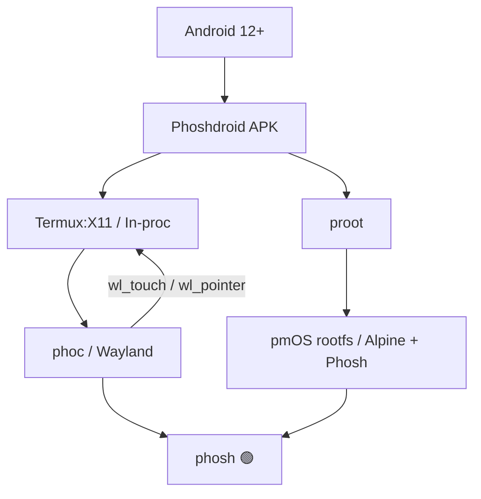

# Phoshdroid


**Phone + Linux, same screen, no root, no tears.**

Phoshdroid enables a full, mobile-first Linux desktop experience on unrooted Android devices by running [postmarketOS](https://postmarketos.org/) and [Phosh](https://gitlab.gnome.org/World/Phosh/phosh) directly within an Android application. It provides a seamless transition from Android to a glassy, functional Linux environment with full-screen rendering and native-feeling touch interactions.

---

## 🚀 Key Features

- **Zero Root Required**: Leverages `proot` and strategic binary placement in `nativeLibraryDir` to bypass Android's W^X execution restrictions. No fastboot, no Magisk, no risks.
- **Integrated X Server**: Incorporates an in-process X server (Termux:X11) consisting of Xlorie, phoc, and phosh. This eliminates the need for complex socket management between separate processes.
- **Native Touch Experience**: Full support for Phosh gestures, including the signature swipe-up lockscreen unlock, achieved through deep optimization of the input stack.
- **Universal Full-Screen**: Dynamically reads device display metrics at launch to size the Wayland output perfectly, utilizing immersive sticky mode and system-gesture exclusion zones.
- **Modern Android Support**: Native support for 16KB page-size devices (Android 15+), ensuring compatibility with the latest hardware.

## 🛠 Architecture

Phoshdroid bridges the gap between Android's Dalvik/ART runtime and a GNU/Linux environment:



- **Android Layer (`app/`)**: Kotlin-based launcher, proot service management, and rootfs extraction.
- **X11 Layer (`termux-x11/`)**: Specialized Xlorie X server and LorieView SurfaceView for touch-to-X11 translation.
- **Terminal Layer (`termux-app/`)**: Integrated terminal emulator and shared infrastructure, optimized for 16KB pages.
- **Linux Layer (`rootfs/`)**: aarch64 rootfs built via `pmbootstrap` with custom Phosh startup scripts and configurations.

## 🏁 Getting Started

### Requirements
- A device running **Android 12 (API 31)** or newer.
- (Optional) `pmbootstrap` if building the rootfs from scratch.

### Installation
```bash
# 1. Clone the repository recursively
git clone --recursive git@github.com:zweck/Phoshdroid.git
cd Phoshdroid

# 2. Build and package the pmOS rootfs (One-time setup)
./rootfs/build-rootfs.sh
./rootfs/package-rootfs.sh

# 3. Assemble and install the APK
./gradlew assembleDebug
adb install -r app/build/outputs/apk/debug/app-debug.apk

# 4. Launch Phoshdroid
adb shell am start -n com.phoshdroid.app/.LauncherActivity
```

## 📊 Current Status

### ✅ What Works
- **Full-Screen Rendering**: High-resolution display matching.
- **Touch Gestures**: Swipe-up unlock and swipe-down control panel.
- **Seamless Entry**: Lockscreen dismisses without PIN requirements.
- **System Integration**: D-Bus session bus availability and immersive Android mode.

### 🚧 Work in Progress
- **SVG Icon Support**: Working toward pre-rasterizing Adwaita icons to bypass `bwrap` requirements in proot.
- **Keyboard Integration**: Implementing `zwp_input_method_v2` to bridge Android's IME with Phosh.
- **System Services**: Bringing NetworkManager and BlueZ functionality to the proot environment.
- **Audio Pipeline**: Developing a PulseAudio/PipeWire bridge to Android AudioTrack.

## 🛠 Engineering Deep Dives

### The `conn_fd` Saga
To achieve a single-process architecture, the project resolved a critical conflict in Termux:X11 where the X server and Activity shared a single `conn_fd` global variable. By splitting this into `server_conn_fd` and `client_conn_fd`, we eliminated the race condition that previously caused black screens.

### The Swipe Saga
Achieving a native lockscreen unlock required solving two distinct input issues:
1. **Phantom Pointer Events**: Gated cursor-follow to `SimulatedTouchInputStrategy` to prevent X11 pointer-motion from overriding Wayland touch events.
2. **Velocity Resets**: Implemented deduplication for identical `XI_TouchUpdate` events to prevent Phosh's velocity estimator from misidentifying swipes as long-presses.

## 🤝 Contributing

Phoshdroid is an ambitious project pushing the boundaries of what is possible on unrooted Android. PRs are welcome! We are particularly looking for help with:
- Proot-compatible SVG loading.
- Wayland input method bridging.
- PulseAudio $\rightarrow$ Android AudioTrack bridges.
- `wlroots` patches for `WLR_X11_OUTPUT_SIZE`.

## 📜 Credits & Licenses

Built upon the shoulders of giants:
- [Termux:X11](https://github.com/termux/termux-x11) & [Termux](https://github.com/termux/termux-app)
- [postmarketOS](https://postmarketos.org/) & [Phosh](https://gitlab.gnome.org/World/Phosh/phosh)
- [proot](https://proot-me.github.io/)

**License**: Distributed under the same GPL-family licenses as the upstream components. See `LICENSE` files in respective submodules.
