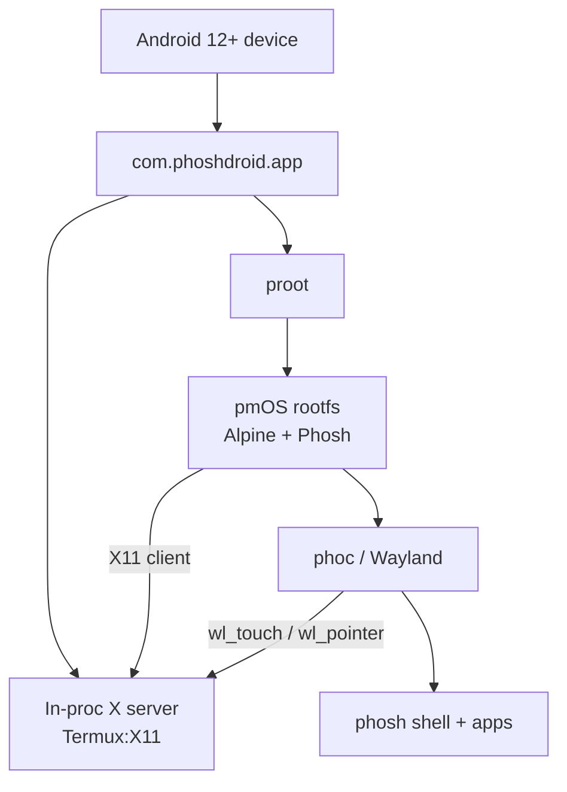

<p align="center">
  
</p>

<h1 align="center">Phoshdroid</h1>

<p align="center">
  <a href="https://github.com/zweck/Phoshdroid/releases/latest"></a>
  
  
</p>


**Phone + Linux, same screen, no root, no tears.**

Phoshdroid ships [postmarketOS](https://postmarketos.org/) and [Phosh](https://gitlab.gnome.org/World/Phosh/phosh) — the mobile Linux shell that runs on the Librem 5 and PinePhone — inside a single Android APK. Tap the icon, swipe to unlock, and you're looking at a real Linux phone desktop running next to Android on unrooted hardware. Phosh apps (Nautilus, Firefox, Console, Contacts, Papers, …) all launch, and your phone's `/sdcard` is bind-mounted into the session so files flow both ways.

---

## 🚀 Features

- **Unrooted.** `proot` and nativeLibraryDir execs bypass Android's W^X rules. No Magisk, no unlocked bootloader.
- **One APK, one process.** Termux:X11 is embedded as a library; Xlorie, phoc, and phosh all live in the same Android process. No cross-process socket dance.
- **Touch-native.** Swipe-up unlocks the lockscreen without a PIN. Swipe-down opens phosh's quick settings.
- **Full-screen, any device.** The launcher reads `displayMetrics` at startup, sizes phoc's Wayland output to match, hides Android's nav bar, and declares a gesture-exclusion rect so the home-swipe doesn't eat phosh's gestures.
- **Fold / unfold aware.** A `DisplayManager.DisplayListener` auto-restarts the phosh session at the new dimensions when a foldable changes mode.
- **Filesystem share.** `/sdcard` is bind-mounted to `/home/user/storage` *and* `/sdcard` inside phosh, so GNOME apps see Downloads, Pictures, Documents, etc. The launcher prompts for "All files access" on first run.
- **Real Adwaita icons.** A small `bwrap` shim lets glycin's image loaders run under proot, so SVG/PNG/JPEG icons render instead of falling back to "missing".
- **Relaunch-safe.** Stale X/Wayland/dbus sockets are wiped on each launch so force-stop + reopen reliably recovers.
- **Modern Android.** 16KB page-size friendly (Android 15+ devices).

## 🛠 Architecture



- **`app/`** — Kotlin: launcher, proot service, asset extraction, display-change handling, permission prompts.
- **`termux-x11/`** (submodule `zweck/termux-x11` @ `phoshdroid-integration`) — Xlorie X server, LorieView SurfaceView, touch → X11 translation, split `conn_fd`, dedup'd `XI_TouchUpdate`.
- **`termux-app/`** (submodule `zweck/termux-app` @ `phoshdroid-integration`) — terminal-emulator + termux-shared linked for 16 KB pages.
- **`rootfs/`** — pmbootstrap-built aarch64 rootfs + overlay (`start.sh`, `bwrap-shim.sh`, fake `/proc/*`).

## 🏁 Install

**Pre-built APK** — grab the latest from [Releases](https://github.com/zweck/Phoshdroid/releases/latest):

```bash
adb install -r phoshdroid-<version>.apk
```

First launch extracts ~1.8 GB of rootfs to the app's private data directory and prompts for "All files access" — approve it so phosh can reach `/sdcard`. Give it 30-60 seconds before phosh shows up.

**Build from source:**

```bash
# Clone with submodules
git clone --recursive git@github.com:zweck/Phoshdroid.git
cd Phoshdroid

# One-time rootfs build (needs pmbootstrap + sudo to tar the chroot)
./rootfs/build-rootfs.sh
./rootfs/package-rootfs.sh

# Debug APK (release build still OOMs on the 1.8 GB asset in compressReleaseAssets)
./gradlew :app:assembleDebug
adb install -r app/build/outputs/apk/debug/app-debug.apk
```

Any phone running **Android 12 (API 31)** or newer. Tested on Android 16 on a Pixel 9 Pro Fold with 16 KB page size.

## 📊 What works

- Phosh shell renders full-screen at device resolution
- Swipe-up unlock (PIN skipped via `sm.puri.phosh.lockscreen require-unlock=false`)
- Swipe-down quick settings / notifications
- Adwaita icon theme (via bwrap shim → glycin loaders)
- Nautilus, Console, Papers, Contacts, Calculator, Calendar, Clocks
- Firefox (content-process sandbox disabled so tabs don't SIGSEGV under proot)
- `/sdcard` visible in Files at `/home/user/storage` and `/sdcard`
- D-Bus user session via `dbus-run-session`
- GNOME apps launch as UID 1000 (not root) so the Nautilus root-refusal doesn't bite
- Fold/unfold triggers a clean session restart

## 🚧 Not yet

- **On-screen keyboard passthrough.** Phosh wants `sm.puri.OSK0` (Stevia); Android's IME is the current fallback.
- **Audio.** PulseAudio isn't bridged to Android's AudioTrack.
- **System services.** No NetworkManager / ModemManager / UPower / BlueZ — proot has no system bus.
- **Release-signed APK.** `compressReleaseAssets` OOMs on the 1.8 GB rootfs; shipping debug-signed for now.

## 🔬 Engineering notes

### The `conn_fd` saga

Termux:X11's upstream design assumes the X server (`CmdEntryPoint`) and the activity (`MainActivity`) run in **separate processes**, sharing a module-level `conn_fd` global. Fine when each process has its own copy. Running both in one process means both sides *literally share the same variable* — the server's `addFd()` writes its end of the socketpair, the activity's `connect_()` writes *its* end to the same variable, server's end is gone, phosh renders into a void. **Fix:** split `conn_fd` into private `server_conn_fd` in `cmdentrypoint.c` and `client_conn_fd` in `activity.c`.

### The swipe saga

Touch events reached phosh correctly — `wl_touch.down` → lots of `wl_touch.motion` → `wl_touch.up`, coordinates right, grabber animation cancelled on touch. But the swipe never committed the unlock. Two layered bugs:

1. **Phantom pointer motion.** Direct-Touch mode was *also* calling `moveCursorToScreenPoint` on every drag, so phoc saw `wl_pointer.motion` with no button held and classified the whole interaction as hover. The real `wl_touch` stream was treated as noise.
2. **Zero-motion velocity resets.** Upstream Termux:X11 forwarded every `ACTION_MOVE` as `XI_TouchUpdate(x, y)` — including the duplicates Android fires when coords haven't changed. Phosh's swipe-velocity estimator saw constant motion at zero velocity and classified the gesture as a long press.

Fix: gate `moveCursorToScreenPoint` to `SimulatedTouchInputStrategy` only, and dedup identical `XI_TouchUpdate` events per pointer id.

### The `bwrap` sandbox saga

gdk-pixbuf 2.44 loads every SVG/PNG/JPEG via [glycin](https://gitlab.gnome.org/sophie-h/glycin), which spawns a `bwrap`-sandboxed subprocess per image. `bwrap` needs `CLONE_NEWUSER` + seccomp; proot can't emulate either, so phosh crashed with SIGABRT on the first icon. **Fix:** a shell script replaces `/usr/bin/bwrap`, parses the flags, drops the sandboxing bits, and execs the target loader. Security is a no-op under proot anyway; the shim just makes the expected command flow through.

## 🤝 Contributing

Issues and PRs welcome. A few open problems:

- A proper gdk-pixbuf SVG loader that works under proot, or pre-rasterising the Adwaita theme to PNG and baking it in
- Wayland `zwp_input_method_v2` client backing onto Android's `InputMethodManager`
- PulseAudio network protocol → Android `AudioTrack` bridge
- phoc / wlroots patch honouring `WLR_X11_OUTPUT_SIZE` so we don't need the `mode=WxH` hack in `phoc.ini`
- Shrinking the rootfs (1.8 GB is a lot)
- Figuring out why `compressReleaseAssets` OOMs even with 16 GB heap, so we can ship a release-signed APK

## 📜 Credits

Phoshdroid stands on the shoulders of much harder work:

- [**Termux:X11**](https://github.com/termux/termux-x11) — the X server on Android
- [**Termux**](https://github.com/termux/termux-app) — terminal + shared infrastructure
- [**postmarketOS**](https://postmarketos.org/) — the Linux distribution
- [**Phosh**](https://gitlab.gnome.org/World/Phosh/phosh) — the mobile shell
- [**proot**](https://proot-me.github.io/) — the unprivileged-root trick that starts the whole house of cards

## License

GPL-family, matching the Termux and Phosh upstreams. See the `LICENSE` files in the submodules for specifics.
